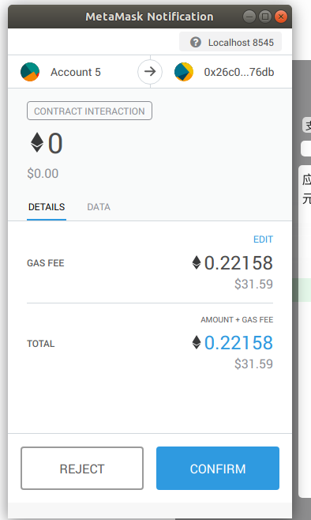
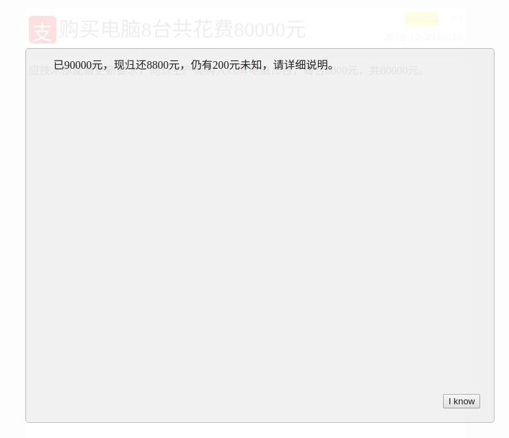

### 财务报表

1. ##### 开发环境：
	- ubuntu 18.04
	- npm 6.5.0
	- nodejs 8.10.0

2. ##### 选题背景、依据：
    - 我国当前一些上市公司为了达到企业高层经济或政治的目的，利用一些不合法的会计手段对企业的财务报表进行造假，造成财务信息失真，不但损害了国家和广大投资者的利益，而且由于财务报表造假，对企业自身形象造成损失，导致企业的生存面临风险。
    - 通过把财务报表部署在区块链上，便可利用区块链的不可篡改性、可追溯性等，保证财务报表的真实性，并且由于财务报表的更新速度慢，很好的避免了区块链目前处理速度慢的问题。

3. ##### 使用说明：

    1. 本次项目基于truffle框架上编写，并通过部署在ganache应用生成的区块链完成，通过插件metamask实现账户的登录和切换。请事先安装好truffle、metamask插件（chrome版或firefox版）和ganache应用（或直接搭建好区块链）。

      - 安装truffle

        ```
        npm install -g truffle
        ```

      - 安装ganache（可以直接进入官网下载客户端或通过以下指令安装命令行版）

        ```
        npm install -g ganache-cli
        ```

      - 安装metamask插件，直接进入官网下载安装（需要科学上网）。

    2. 按照搭建的区块链的地址修改truffle-config.js中的地址（默认为127.0.0.1:8545），然后在根目录输入truffle migrate( --reset)把合约部署到区块链上。

          

          

    3. 在根目录上输入npm run dev启动lite-server服务器，监听app和合约，之后便可在浏览器输入localhost:3000访问。

          

          

    4. 插件metamask连接区块链，通过Custom RPC加入区块链地址，并通过账户私钥导入区块链账户。

          

          

4. ##### 测试

    - 新建财务信息：在输入框输入对应的信息提交，并在弹出的窗口确认便可得到。

	

	

	

      点击后便可直接进入详情页面。

	

    - 添加用户地址到本地，以免忘记账户地址而无法调用。

	

    - 请求用户确认：添加账户过后便可直接通过用户名请求确认，这里请求三个账户则要三次metamask确认。

	

    - 确认后便可切换用户进行确认（同意或者反对，反对则需要输入意见）。

	

      提交意见后便会在右侧弹出意见。

	

    - 获取意见（只有财务信息提交者才有权利看到所有意见，其余人不能看到）。

	

    - 统计结果：根据确认人数来判断该财务信息是否通过，按照规定，需要在一天之后才能统计，并且只有发起者才能统计，否则会报错。

	

      如图，提前确认则会回滚并报错。
      
5. ##### 参考链接

	petshop教程：http://www.cocoachina.com/blockchain/20180126/22017.html

	lite-server教程：https://www.npmjs.com/package/lite-server

	web3.js API 中文文档：http://web3.tryblockchain.org/
